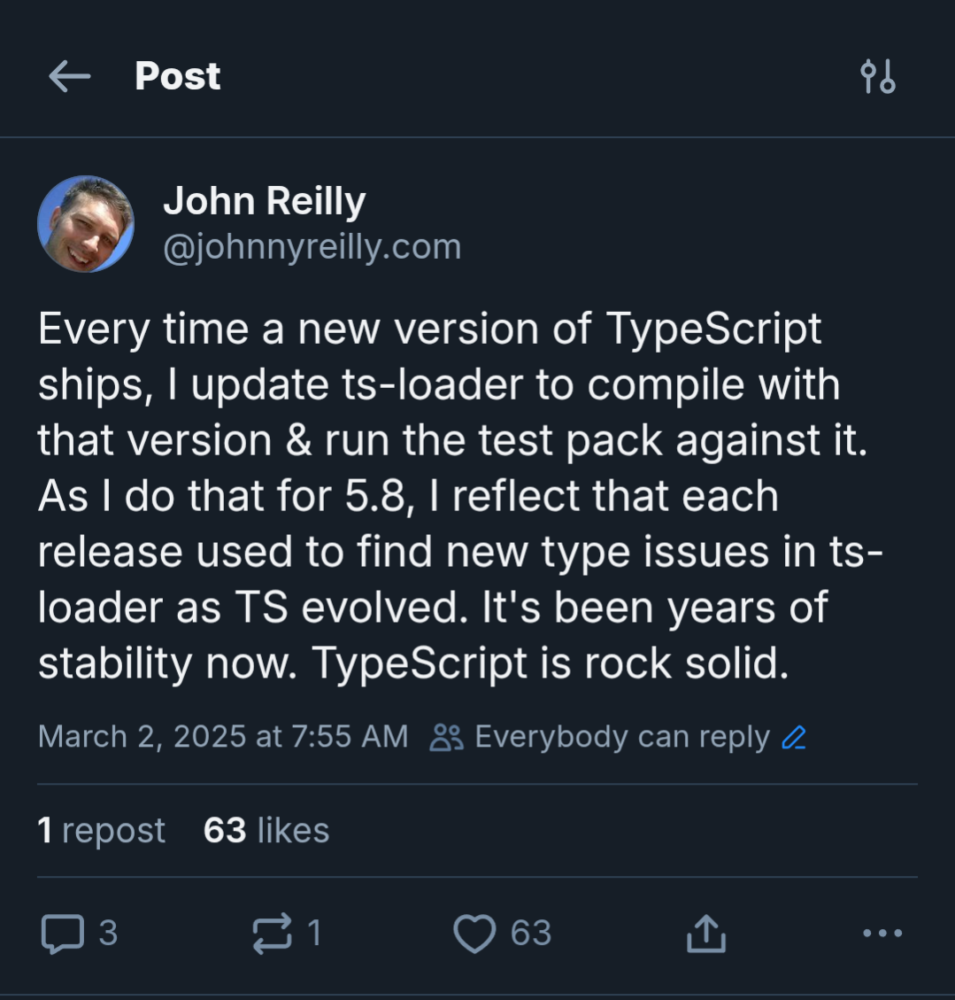

# TypeScript Go considered brilliant

TypeScript is being ported to Go. This is known as "TypeScript 7". It's quite likely that you know this by now, as there have been excellent communications from the TypeScript team in a variety of forums. Hats off; it's been an object lesson in how to communicate well; straightforward, clear and open.

There's no shortage of content out there detailing what is known about the port. This piece is not that. Rather, it's the reflections of two people in the TypeScript community. What our thoughts, feelings and reflections on the port are.

It's going to be a somewhat unstructured wander through our reactions and hopes. Buckle up for opinions and feelings.

## Who are John Reilly and Ashley Claymore?

John Reilly is a software engineer and an early adopter of TypeScript. He worked on Definitely Typed, the home of high quality type definitions which allow the integration of TypeScript and JavaScript. John wrote the [history of Definitely Typed](https://johnnyreilly.com/definitely-typed-the-movie) and featured in the TypeScript documentary. He also worked (and works) on ts-loader, the webpack loader for TypeScript. In his day job, he works at Investec, a South African bank and is based in London. The greatest city on earth (in his opinion).

Ashley is also a software engineer in London and first started writing TypeScript when it was on version 1.8. He has contributed to TypeScript and works at Bloomberg as part of the JavaScript infrastructure and tooling team. Opinions are his own.

## Performance

It's useful to think about what the Go port meaningfully changes.

Josh Goldberg has [provided a useful framing on different aspects of TypeScript](https://www.learningtypescript.com/articles/what-is-typescript). It's four things:
1. Language
2. Type Checker
3. Compiler
4. Language services

The language is unaffected by the port. Syntax is unchanged. You'll still be writing `type`s and `interfaces`s as you were before. No difference.

The same applies to the checks that the type checker is performing. The code that was detected as an error before will still fail to type check with TypeScript 7:

```ts
const i: number = "not actually a number";
// ts: Type 'string' is not assignable to type 'number'
```

This is where the differences begin. The type checker, compiler, and the language services do change. They become an order of magnitude faster.

Put your hands up if you don't care about performance. That's right, no hands went up. We all care about performance. If you ever have the misfortune to work with technology that lags, which breaks you out of flow as you are working, you notice it. It's almost the only thing you can notice.

The TypeScript team has always cared about performance, particularly in the area of development tooling. Anders Hejlsberg in particular has mentioned in interviews, the need for language servers to provide fast feedback as people work. Something measured in milliseconds and not seconds.

What are the implications of these changes to the TypeScript ecosystem? Put simply: a faster VS Code and faster builds.

Where John works, at Investec, there are many engineers who use VS Code, and spend part of their engineering life writing TypeScript and JavaScript. All those engineers will benefit from a snappier development experience. When they open up a project in VS Code, the time taken for the language service to wake up will drop dramatically. As they refactor their code, the experience will be faster. The "time to red squiggly line" metric will decrease. And that's a good thing.

As a consequence, engineers should be incrementally more effective, given that there are less pauses in their workflow.

The same incremental gain applies to builds. As our engineers build applications, they run TypeScript builds on their machines and in a Continuous Integration context.  These will all be faster than they were before. We'll continually bank a performance improvement which is a benefit.

This, of course, is not Investec or Bloomberg specific. Rather this is a general improvement that everyone will benefit from. Across the world, wherever anyone writes and builds TypeScript, they will do so faster.

## The TypeScript team will write less TypeScript

Many languages have [bootstrapping compilers](https://en.wikipedia.org/wiki/Bootstrapping_(compilers)). The compiler is written in the program language that it is the compiler for. TypeScript has been an example of this since it was first open sourced. That is about to change; the compiler will stop being written in TypeScript and will start being written in Golang. This is possibly the first example of a language moving away from having a bootstrapping compiler. This is done in the name of performance.

Of all the aspects about the Golang port, this one was the one that gave John most anxiety. (It's John writing this by the way, writing in the third person feels very strange.) The TypeScript team will be moving away from writing TypeScript in their day to day lives. They won't abandon it of course, but they will certainly write less TypeScript and more Golang. An implication of this is that there will be reduced [dogfooding](https://en.wikipedia.org/wiki/Eating_your_own_dog_food) - which means less direct feedback to the makers of TypeScript about what it's like to write TypeScript.

Given how broad the TypeScript community is, this is perhaps not the concern that it might be. The team are very connected with the community and even if they are writing TypeScript less, people who are writing more will be sure to be vocal. It's maybe worth remembering that for most of the time TypeScript has been around, the team has often written TypeScript in a style that is not representative of the broader community.  We're thinking here of classes (talked about below), and until recently modules. Jake Bailey's mammoth work to [migrate the TypeScript codebase to use modules](https://devblogs.microsoft.com/typescript/typescripts-migration-to-modules/), the codebase used namespaces.  This didn't stop TypeScript working with on improving support for these JavaScript features at all.  So it seems reasonable we need not fear.

Another angle on this, is wondering if the TypeScript team might become less involved with TC39 (the committee that develops the JavaScript language specification). TypeScript have been instrumental in language development over the years, from optional chaining to decorators and beyond. As the TypeScript team will be writing less TypeScript, there's a view that they might become less directly involved in influencing the development of JavaScript.

> Ashley is not worried about this. The Principal Product Manager of TypeScript, Daniel Rosenwasser, recently became one of the [two incoming TC39 Facilitators](https://github.com/tc39/agendas/blob/main/2025/TC39%20Chair%20Group%20Election%20-%20106th%20Meeting.pdf). The importance of having the TypeScript teams input into the evolution of JavaScript remains the same regardless of which language is used to implement TypeScript's analysis of JavaScript.

## Interacting with TypeScript

There are four primary ways to interact with the TypeScript package.

- Via its command line interface `tsc`
    - There will still be a CLI and it sounds like the goal will be very close compatibility. So it may change to be Go and you would still be able to interact with the CLI in the same way
- Via its JavaScript API, importing it as a module `import ts from "typescript"`
    - The TypeScript team are still working on this part. It's almost certain that there will be changes here, but exactly how different they are is not yet known.
    - One core question is if the currently synchronous API will need to become asynchronous due to calling Go, as this can be a difficult change to migrate to (LINK TO function coloring blog?). The good news here is that it looks like it will be able to retain a synchronous API.
- Via the language server `tsserver`
    - Editors such as VSCode, and even linters, can interact with TypeScript via its language server.
    - Interestingly even though TypeScript helped inspire the LSP specification it doesn't actually implement it. The TypeScript team are using the port as an opportunity to align with the LSP specification. This is a positive change.
- Via another tool that uses TypeScript internally
    - Tools use one or a combination of the above to use TypeScript on their user's behalf. There will be work for the tools, but this might be done transparently to the end developer.

## Ecosystem tools

This will have an impact on ecosystem tooling.  John is the maintainer of [`ts-loader`](https://github.com/TypeStrong/ts-loader), a widely used webpack loader for TypeScript. This loader depends upon TypeScript APIs which have been unchanged in years.

In fact, in John went so far as to comment as such on [Bluesky in early March](https://bsky.app/profile/johnnyreilly.com/post/3ljexijnmdk2m):



Only to have the TypeScript team effectively come out and say "hold my beer".

It's very early days, but we know for sure that the internal APIs of TypeScript (that `ts-loader` depends upon) will change. `ts-loader` has two modes of operation:
1. With type checking
2. Without type checking; transpilation only

It's very unlikely that TypeScript 7 will work with `ts-loader`s type checking mode, without significant refactoring. It's possible that `ts-loader` might be able to support transpilation only mode with minimal changes. What does this mean for the future of `ts-loader` (and by extension, other tooling built on TypeScript)? Well, there will be an impact.  This might be the natural end of the road for `ts-loader`.  It's also possible that it could continue onwards, but supporting transpilation only. But that is uncertain.  Also, there already alternatives that perform that role, such as `esbuild-loader` and `swc-loader`.

Some tooling will have a natural path forwards.  For instance, `typescript-eslint` will continue onwards with TypeScript 7. The TypeScript team are planning to help with typed linting with the new, faster APIs.  So this means that ESLint (which many people are used to using), will become faster, as TypeScript becomes faster.

However, it's likely that tooling that depends upon internal TypeScript APIs which are going to radically change, may cease to be in their current forms.  This will vary project by project, but expect change. And this is fine.  Change is a constant.

## Was Go a good language choice?

Given that TypeScript decided to move away from being written with TypeScript, many people had and have opinions on the language being picked: Go. The folk who like C# wish that the team had picked C#. Particularly given Anders' involvement with C#. Those people that like Rust would very much have liked for the team to have picked Rust.  Hopefully this is not unkind, but there is a section of the internet that seems to feel that everything should be written in Rust.

If John was to guess what the team might have picked he would have either said Rust or Zig (what Bun is built with).  Golang felt like a slightly leftfield choice, but upon reflection it completely makes sense. ESBuild is written in Golang, so there's prior art. Golang has a garbage collector (Rust does not) which means the work of porting the code is not too significant.  Likewise, C# is all about `class`es and so a port from TypeScript (which does not use `class`es in the compiler codebase) to C# would be uphill work.

The Golang choice represents pragmatism; which is very much a TypeScript ethos. In fact if you look at the [TypeScript Design goals](https://github.com/microsoft/TypeScript/wiki/TypeScript-Design-Goals), you can see how TypeScript has always espoused a pragmatic approach. Perhaps most famously by having "soundness" as a "non-goal". Instead, striking a balance between correctness and productivity.

Pragmatism is the TypeScript way. Golang is a pragmatic choice.

## Conclusion

As you looked around the ecosystem, and saw the desire for performance that has been ever present for the last three years, some kind of port seemed inevitable. If we accept that, and I think we should, the way the team has started executing on the migration fills us with confidence. The TypeScript team are talented, pragmatists and wise.

This is going to Go well.